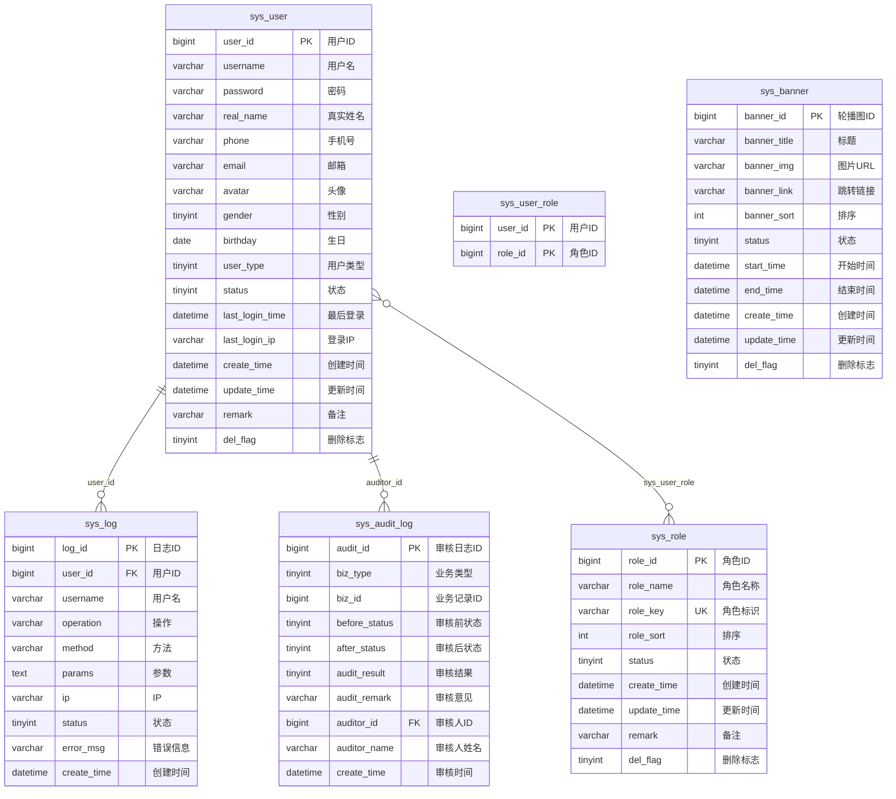
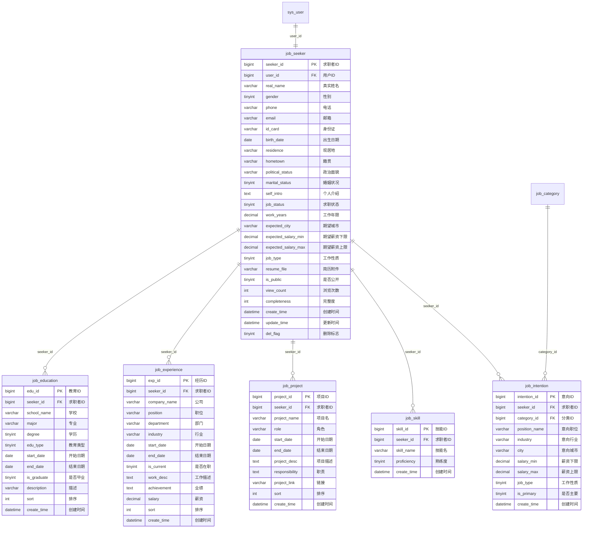
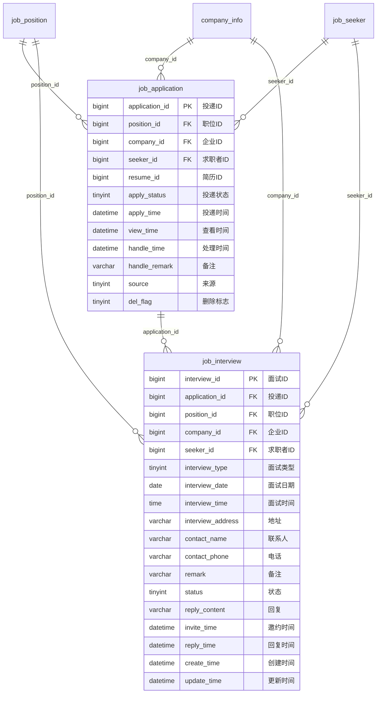
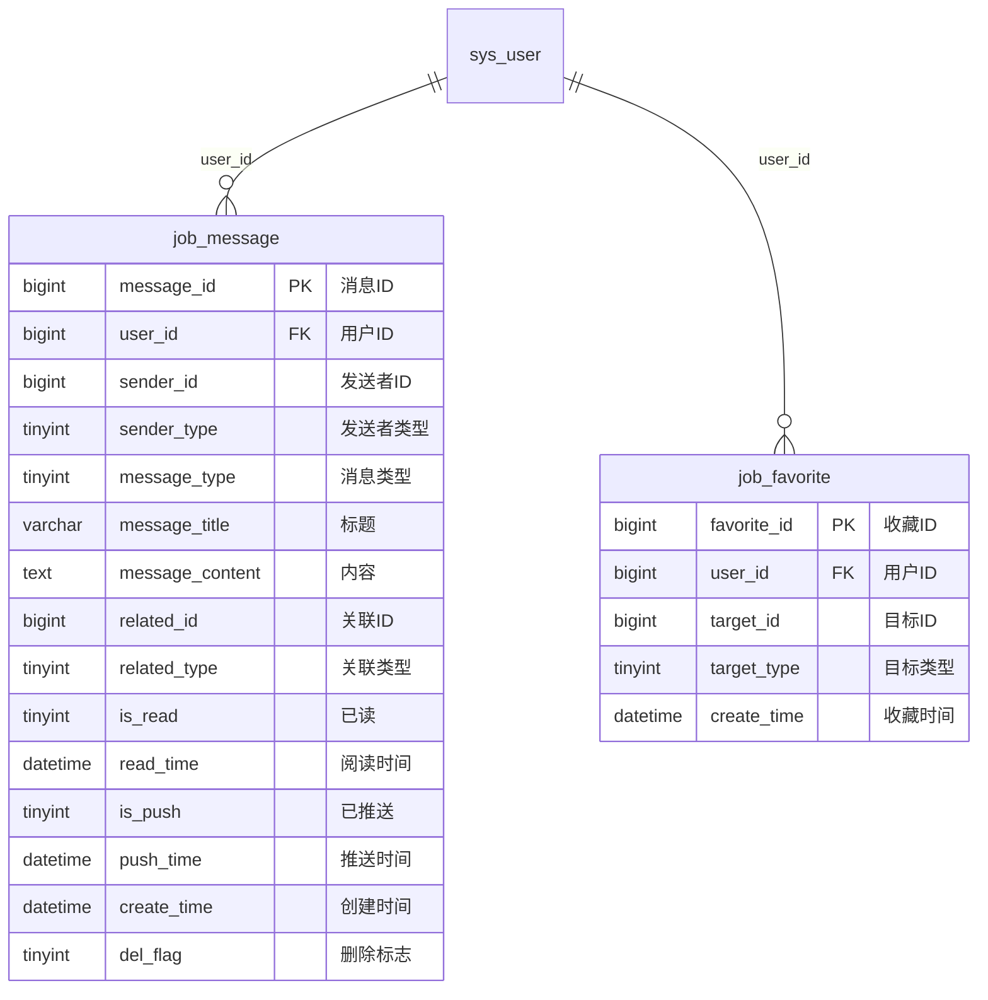

# 校企慧招聘模块数据库ER模型图

---

## 一、概念模型 (Conceptual Model)

> 概念模型关注业务实体及其关系，不涉及具体数据库实现细节

```mermaid
erDiagram
    %% 用户权限模块
    USER ||--|| SEEKER : "对应"
    USER ||--|| COMPANY : "对应"
    
    %% 求职者模块
    SEEKER ||--o{ EDUCATION : "包含"
    SEEKER ||--o{ EXPERIENCE : "包含"
    SEEKER ||--o{ PROJECT : "包含"
    SEEKER ||--o{ SKILL : "具备"
    SEEKER ||--o{ INTENTION : "期望"
    
    %% 企业模块
    COMPANY ||--o{ COMPANY_AUTH : "提交"
    COMPANY ||--o{ POSITION : "发布"
    
    %% 招聘流程
    SEEKER ||--o{ APPLICATION : "投递"
    POSITION ||--o{ APPLICATION : "接收"
    COMPANY ||--o{ APPLICATION : "处理"
    APPLICATION ||--|| INTERVIEW : "触发"
    
    %% 平台管理
    CATEGORY ||--o{ POSITION : "归类"
    CATEGORY ||--o{ INTENTION : "关联"
    USER ||--o{ MESSAGE : "接收"
    USER ||--o{ FAVORITE : "收藏"
    
    %% 角色权限
    USER }o--o{ ROLE : "拥有"
    
    %% 平台内容
    BANNER {
        bigint banner_id PK "轮播图ID"
        string banner_img "图片URL"
        int status "状态"
    }
    
    %% 系统管理
    USER ||--o{ LOG : "产生"
    USER ||--o{ AUDIT_LOG : "审核"

    USER {
        bigint user_id PK "用户ID"
        string username "用户名"
        int user_type "用户类型"
    }
    
    SEEKER {
        bigint seeker_id PK "求职者ID"
        bigint user_id FK "用户ID"
        string real_name "真实姓名"
        int job_status "求职状态"
    }
    
    EDUCATION {
        bigint edu_id PK "教育ID"
        bigint seeker_id FK "求职者ID"
        string school_name "学校"
        int degree "学历"
    }
    
    EXPERIENCE {
        bigint exp_id PK "经历ID"
        bigint seeker_id FK "求职者ID"
        string company_name "公司"
        string position "职位"
    }
    
    PROJECT {
        bigint project_id PK "项目ID"
        bigint seeker_id FK "求职者ID"
        string project_name "项目名称"
    }
    
    SKILL {
        bigint skill_id PK "技能ID"
        bigint seeker_id FK "求职者ID"
        string skill_name "技能名称"
    }
    
    INTENTION {
        bigint intention_id PK "意向ID"
        bigint seeker_id FK "求职者ID"
        bigint category_id FK "分类ID"
        string position_name "意向职位"
    }
    
    COMPANY {
        bigint company_id PK "企业ID"
        bigint user_id FK "用户ID"
        string company_name "企业名称"
        int auth_status "认证状态"
    }
    
    COMPANY_AUTH {
        bigint auth_id PK "认证ID"
        bigint company_id FK "企业ID"
        int audit_status "审核状态"
    }
    
    POSITION {
        bigint position_id PK "职位ID"
        bigint company_id FK "企业ID"
        bigint category_id FK "分类ID"
        string position_name "职位名称"
        int status "状态"
    }
    
    CATEGORY {
        bigint category_id PK "分类ID"
        bigint parent_id "父分类ID"
        string category_name "分类名称"
        int category_type "类型"
    }
    
    APPLICATION {
        bigint application_id PK "投递ID"
        bigint position_id FK "职位ID"
        bigint seeker_id FK "求职者ID"
        bigint company_id FK "企业ID"
        int apply_status "投递状态"
    }
    
    INTERVIEW {
        bigint interview_id PK "面试ID"
        bigint application_id FK "投递ID"
        bigint position_id FK "职位ID"
        bigint seeker_id FK "求职者ID"
        bigint company_id FK "企业ID"
        int interview_type "面试类型"
        int status "状态"
    }
    
    MESSAGE {
        bigint message_id PK "消息ID"
        bigint user_id FK "用户ID"
        int message_type "消息类型"
        boolean is_read "已读"
    }
    
    FAVORITE {
        bigint favorite_id PK "收藏ID"
        bigint user_id FK "用户ID"
        bigint target_id "目标ID"
        int target_type "目标类型"
    }
    
    ROLE {
        bigint role_id PK "角色ID"
        string role_name "角色名称"
        string role_key "角色标识"
        int status "状态"
    }
    
    AUDIT_LOG {
        bigint audit_id PK "审核日志ID"
        int biz_type "业务类型"
        bigint biz_id "业务ID"
        int audit_result "审核结果"
        bigint auditor_id FK "审核人"
        datetime create_time "审核时间"
    }
    
    LOG {
        bigint log_id PK "日志ID"
        bigint user_id FK "用户ID"
        string operation "操作"
    }
```



---

## 二、物理模型 (Physical Model)

> 物理模型包含完整的数据库表结构、字段类型、约束和索引信息

### 2.1 用户权限模块



### 2.2 求职者模块



### 2.3 企业模块

```mermaid
erDiagram
    sys_user ||--|| company_info : "user_id"
    company_info ||--o{ company_auth : "company_id"
    company_info ||--o{ job_position : "company_id"
    job_category ||--o{ job_position : "category_id"
    
    company_info {
        bigint company_id PK "企业ID"
        bigint user_id FK "用户ID"
        varchar company_name "企业名称"
        varchar short_name "简称"
        varchar company_logo "Logo"
        varchar company_cover "封面"
        varchar industry "行业"
        tinyint company_scale "企业规模"
        tinyint company_type "企业性质"
        date found_date "成立日期"
        decimal registered_capital "注册资本"
        varchar business_license "营业执照号"
        varchar license_image "执照图片"
        varchar website "官网"
        varchar province "省"
        varchar city "市"
        varchar district "区县"
        varchar address "详细地址"
        decimal longitude "经度"
        decimal latitude "纬度"
        varchar contact_name "联系人"
        varchar contact_phone "电话"
        varchar contact_email "邮箱"
        text company_intro "企业介绍"
        varchar company_welfare "福利"
        varchar work_time "工作时间"
        varchar work_address "办公地址"
        tinyint auth_status "认证状态"
        datetime auth_time "认证时间"
        int view_count "浏览次数"
        int position_count "职位数"
        tinyint status "状态"
        datetime create_time "创建时间"
        datetime update_time "更新时间"
        tinyint del_flag "删除标志"
    }
    
    company_auth {
        bigint auth_id PK "认证ID"
        bigint company_id FK "企业ID"
        tinyint auth_type "认证类型"
        varchar legal_person "法人"
        varchar id_card "身份证号"
        varchar id_card_front "身份证正面"
        varchar id_card_back "身份证反面"
        varchar business_license "营业执照号"
        varchar license_image "执照图片"
        datetime apply_time "申请时间"
        datetime audit_time "审核时间"
        tinyint audit_status "审核状态"
        varchar audit_remark "审核备注"
        bigint auditor_id "审核人"
    }
    
    job_category {
        bigint category_id PK "分类ID"
        bigint parent_id "父分类"
        varchar category_name "分类名"
        varchar category_code "分类编码"
        tinyint category_type "类型"
        tinyint category_level "层级"
        int category_sort "排序"
        varchar icon "图标"
        tinyint status "状态"
        datetime create_time "创建时间"
        datetime update_time "更新时间"
        tinyint del_flag "删除标志"
    }
    
    job_position {
        bigint position_id PK "职位ID"
        bigint company_id FK "企业ID"
        bigint category_id FK "分类ID"
        varchar position_name "职位名"
        tinyint position_type "职位类型"
        int recruit_num "招聘人数"
        decimal salary_min "薪资下限"
        decimal salary_max "薪资上限"
        tinyint salary_negotiable "面议"
        varchar city "城市"
        varchar district "区域"
        varchar address "地址"
        int experience_min "经验下限"
        int experience_max "经验上限"
        tinyint education "学历要求"
        text job_desc "职位描述"
        text job_requirement "任职要求"
        varchar job_welfare "福利"
        varchar skill_required "技能要求"
        varchar keywords "关键词"
        varchar contact_name "联系人"
        varchar contact_phone "电话"
        varchar contact_email "邮箱"
        int view_count "浏览次数"
        int apply_count "投递次数"
        tinyint status "状态"
        tinyint is_urgent "急招"
        tinyint is_recommend "推荐"
        datetime publish_time "发布时间"
        datetime refresh_time "刷新时间"
        datetime end_time "截止时间"
        bigint create_by "创建人"
        datetime create_time "创建时间"
        datetime update_time "更新时间"
        datetime audit_time "审核时间"
        varchar audit_remark "审核备注"
        tinyint del_flag "删除标志"
    }
```



### 2.4 招聘流程模块



### 2.5 平台功能模块



---

## 三、实体关系ASCII图

### 整体架构

```
┌─────────────────────────────────────────────────────────────────────────────┐
│                              用户权限模块                                    │
├─────────────────────────────────────────────────────────────────────────────┤
│                                                                             │
│   ┌──────────────┐                                                          │
│   │   sys_user   │                                                          │
│   │   (用户表)    │                                                          │
│   └──────┬───────┘                                                          │
│          │                                                                  │
│          │ 1:1                                                              │
│          ▼                                                                  │
│   ┌──────────────┐                                                          │
│   │  job_seeker  │          ┌──────────────┐      ┌──────────────┐          │
│   │  (求职者)     │          │ company_info │      │ company_auth │          │
│   └──────┬───────┘          │   (企业)     │◄────►│  (企业认证)   │          │
│          │                  └──────┬───────┘      └──────────────┘          │
│          │ 1:1                     │                                        │
│          │                         │ 1:N                                      │
│          ▼                         ▼                                         │
│   ┌──────────────┐          ┌──────────────┐                                │
│   │job_education │          │ job_position │                                │
│   │  (教育经历)   │          │   (职位)     │                                │
│   ├──────────────┤          └──────┬───────┘                                │
│   │job_experience│                 1:N                                       │
│   │  (工作经历)   │                  │                                       │
│   ├──────────────┤                  ▼                                       │
│   │  job_skill   │          ┌──────────────┐                                │
│   │   (技能)     │          │job_application│                               │
│   ├──────────────┤          │  (投递记录)   │                               │
│   │ job_project  │          └──────┬───────┘                                │
│   │  (项目经验)   │                 1:1                                       │
│   └──────────────┘                  │                                        │
│                                     ▼                                        │
│                             ┌──────────────┐                               │
│                             │ job_interview│                               │
│                             │  (面试邀约)   │                               │
│                             └──────────────┘                               │
│                                                                             │
└─────────────────────────────────────────────────────────────────────────────┘

┌─────────────────────────────────────────────────────────────────────────────┐
│                              平台管理模块                                    │
├─────────────────────────────────────────────────────────────────────────────┤
│                                                                             │
│   ┌──────────────┐    ┌──────────────┐                                      │
│   │   sys_log    │    │ job_message  │                                      │
│   │   (操作日志)  │    │   (消息通知)  │                                      │
│   └──────────────┘    └──────────────┘                                      │
│                                                                             │
│   ┌──────────────┐    ┌──────────────┐                                      │
│   │job_favorite  │    │ job_category │                                      │
│   │   (收藏)      │    │  (职位分类)   │                                      │
│   └──────────────┘    └──────────────┘                                      │
│                                                                             │
└─────────────────────────────────────────────────────────────────────────────┘
```

---

## 四、核心业务流

### 4.1 求职者求职流程

```
┌──────────┐    ┌──────────┐    ┌──────────┐    ┌──────────┐    ┌──────────┐
│ 注册/登录 │───►│ 完善简历  │───►│ 搜索职位  │───►│ 投递简历  │───►│ 面试邀约  │
│ sys_user │    │job_seeker│    │job_position│   │job_application│ │job_interview│
└──────────┘    └──────────┘    └──────────┘    └──────────┘    └──────────┘
       │              │               │               │               │
       │              │               │               │               │
       ▼              ▼               ▼               ▼               ▼
  job_education  job_skill     job_category    job_message      job_message
  job_experience                                                     
  job_project                                                     
```

### 4.2 企业招聘流程

```
┌──────────┐    ┌──────────┐    ┌──────────┐    ┌──────────┐    ┌──────────┐
│ 企业注册  │───►│ 企业认证  │───►│ 发布职位  │───►│ 简历筛选  │───►│ 面试管理  │
│ sys_user │    │company_  │    │job_      │    │job_      │    │job_      │
│          │    │   info   │    │position  │    │application│    │interview │
└──────────┘    └──────────┘    └──────────┘    └──────────┘    └──────────┘
       │              │               │               │               │
       │              │               │               │               │
       ▼              ▼               ▼               ▼               ▼
              company_auth      job_category    job_message      job_message
```

---

## 五、表关系详情

### 5.1 一对一关系

| 主表 | 从表 | 关系说明 |
|------|------|----------|
| sys_user | job_seeker | 一个用户对应一个求职者 |
| sys_user | company_info | 一个用户对应一个企业 |
| job_application | job_interview | 一次投递对应一次面试邀约(可选) |

### 5.2 一对多关系

| 主表 | 从表 | 关系说明 |
|------|------|----------|
| job_seeker | job_education | 一个求职者有多条教育经历 |
| job_seeker | job_experience | 一个求职者有多条工作经历 |
| job_seeker | job_skill | 一个求职者有多个技能 |
| job_seeker | job_project | 一个求职者有多个项目经验 |
| job_seeker | job_intention | 一个求职者有多个求职意向 |
| company_info | job_position | 一个企业发布多个职位 |
| company_info | job_application | 一个企业收到多份简历投递 |
| job_position | job_application | 一个职位被多次投递 |
| sys_user | job_message | 一个用户收到多条消息 |
| sys_user | job_favorite | 一个用户有多个收藏 |
| job_category | job_position | 一个分类下有多个职位 |

### 5.3 多对多关系

| 表A | 表B | 中间表 | 关系说明 |
|------|------|--------|----------|
| job_seeker | job_position | job_application | 求职者与职位投递关系 |

---

## 六、关键索引策略

### 6.1 主键索引

所有表使用 `BIGINT(20) AUTO_INCREMENT` 作为主键

### 6.2 唯一索引

- `sys_user.username` - 用户名唯一
- `sys_user.phone` - 手机号唯一
- `job_application.position_id + seeker_id` - 同职位不能重复投递
- `job_favorite.user_id + target_id + target_type` - 同目标不能重复收藏

### 6.3 外键索引

所有外键字段自动建立索引，确保关联查询性能

### 6.4 业务索引

- 职位搜索：`city + category_id + status`
- 职位列表：`status + is_recommend + publish_time`
- 简历列表：`is_public + del_flag`
- 投递记录：`seeker_id + apply_status` / `company_id + apply_status`
- 消息查询：`user_id + is_read`

### 6.5 全文索引

- `job_position.position_name` - 职位名称全文搜索
- `job_position.keywords` - 关键词全文搜索

---

## 七、数据流状态机

### 7.1 简历投递状态流转

```
┌──────────┐    ┌──────────┐    ┌──────────┐    ┌──────────┐
│  已投递   │───►│  已查看   │───►│  感兴趣   │───►│  已邀约   │
│    1     │    │    2     │    │    3     │    │    5     │
└──────────┘    └──────────┘    └────┬─────┘    └────┬─────┘
                                      │               │
                                      ▼               ▼
                               ┌──────────┐    ┌──────────┐
                               │  不合适   │    │  已录用   │
                               │    4     │    │    6     │
                               └──────────┘    └────┬─────┘
                                                     │
                                                     ▼
                                               ┌──────────┐
                                               │  已拒绝   │
                                               │    7     │
                                               └──────────┘
```

### 7.2 企业认证状态流转

```
┌──────────┐    ┌──────────┐    ┌──────────┐
│  未认证   │───►│  审核中   │───►│  已认证   │
│    0     │    │    1     │    │    2     │
└──────────┘    └────┬─────┘    └──────────┘
                     │
                     ▼
               ┌──────────┐
               │ 认证失败  │
               │    3     │
               └──────────┘
```

### 7.3 职位状态流转

```
┌──────────┐    ┌──────────┐    ┌──────────┐    ┌──────────┐
│  待审核   │───►│  招聘中   │───►│  已暂停   │    │  已结束   │
│    0     │    │    1     │◄───│    2     │───►│    3     │
└────┬─────┘    └──────────┘    └──────────┘    └──────────┘
     │
     ▼
┌──────────┐
│ 审核驳回  │
│    4     │
└──────────┘
```

---

## 八、Mermaid语法说明

本ER模型图使用Mermaid的ER Diagram语法绘制，可在支持Mermaid的Markdown编辑器（如Typora、VS Code、GitLab、GitHub等）中直接渲染。

### 关系符号说明

| 符号 | 含义 |
|------|------|
| `||--o{` | 一对多关系（强制-可选） |
| `||--||` | 一对一关系 |
| `}o--o{` | 多对多关系 |
| PK | Primary Key - 主键 |
| FK | Foreign Key - 外键 |
| UK | Unique Key - 唯一键 |
| IDX | Index - 索引 |
| FT | Fulltext - 全文索引 |

---

**文档版本**: 1.1  
**更新日期**: 2026-04-09  
**更新内容**: 
- 移除已删除的实体（sys_role, sys_user_role, sys_dict, sys_config, sys_notice, sys_banner）
- 修复Mermaid物理模型字段类型语法（将 varchar_50 改为 varchar）
